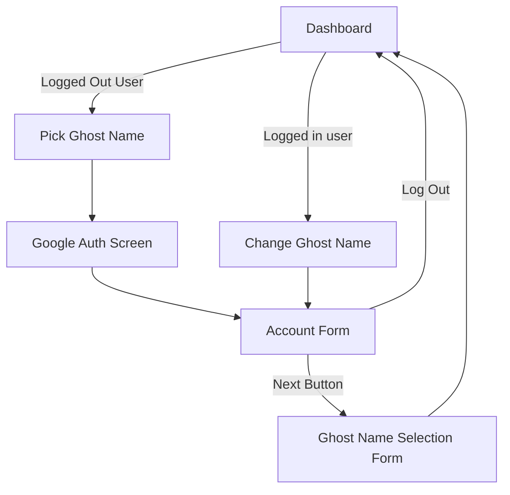

# Overview
## App URL preview
https://elevated-cat-465604-h1.ts.r.appspot.com/ \
> [!NOTE]
> I might have to add people to the whitelist as I am not part of any organisation and can only run it in the Test mode (up to 100 testers)
## Stack
- **Jinja HTML / SCSS + Preprocessor**\
A simple front, as minimalistic as possible. Jinja templates come with Flask, so I am using them as is. SCSS for simpler style nesting, minification and quality of life. I am using an external preprocessor for simplicity.
- **Flask**\
Lightweight Python framework. Easy routing, no fluff, pretty much everything could be custom. Love it ❤️
- **Google Python3 Secure Scaffold**\
Used it as it was recommended in the brief. A solid kickstart boilerplate.
- **Google Firebase Datastore**\
NoSQL implementation from Google
- **Google Cloud NDB**
Python lib. A wrapper for the Firebase Datastore.
- **Google Authentication**
An easy way to authenticate users
- **Google App Engine**
A serverless platform for deployment
## Dataflow chart

## Models and methods
There are two data models present: "User" and "GhostNames"
```python
class User(ndb.Model):
    # Indexed for the sake of unique checks upon registrations
    email = ndb.StringProperty(required=True)
    first_name = ndb.StringProperty()
    last_name = ndb.StringProperty()
    ghost_name = ndb.StringProperty(default="")
    ghost_description = ndb.TextProperty(default="")
    # Refers back to the GhostNames model unique hash
    ghost_unique_hash = ndb.StringProperty(default="")

    # QOL misc fields
    created_at = ndb.DateTimeProperty(indexed=False, auto_now_add=True)
    updated_at = ndb.DateTimeProperty(indexed=False, auto_now_add=True)
```
```python
class GhostNames(ndb.Model):
    # Indexed so we can pass it around the front and query by it
    ghost_unique_hash = ndb.StringProperty(required=True, indexed=True)
    ghost_name = ndb.StringProperty(required=True)
    ghost_description = ndb.TextProperty(default="")
    first_name = ndb.StringProperty()
    last_name = ndb.StringProperty()
    # Indexed so we can query free and taken names
    email = ndb.StringProperty()
    # We need this one indexed, so we can show the same choice upon page refresh
    # Potential TODO: implement frontend caching to decrease the number of reads
    reserved_by_email = ndb.StringProperty()
    # Indexed so we can check if a name is reserved as one of three names
    reserved_at = ndb.DateTimeProperty(auto_now_add=True)

    # QOL misc fields
    created_at = ndb.DateTimeProperty(indexed=False, auto_now_add=True)
    updated_at = ndb.DateTimeProperty(indexed=False, auto_now_add=True)
```

Both models are fairly simple and denormalised to minimise read/write counts and total costs.  
Quality of life properties are in place for potential future improvements. As the system grows, it requires more robust sorting and querying. Having those fields on the documents makes life easier in the future.

### create_or_get_user
Creates a user doc if it does not exist, retrieves one if it does exist. At most, it does a couple of reads/writes, so practically free

### update_user
Updates the first and last names on the user. Fans ought to update the associated Ghost Name document, but since there's always only one Ghost Name doc chosen by the user, it's still fairly cheap.  
Every update is wrapped in a transactional decoration, so it could only be applied if no changes have been made by someone else in the process. Otherwise, it rolls back and bails out.  
So that should cover optimistic concurrency behaviours.

### get_ghost_all_names
A simple fetch of Ghost Names that have been taken by someone. Used on the Dashboard to show the list.  
As the Ghost Name list is fairly small, it is simple as it is. If in the future the list grows, there's a place for potential pagination implementation or infinite scroll.

### select_ghost_name
A method to associate a ghost name with a user. With transactional decoration, it basically clears out all of the reserved Ghost Names for the user it could find, releases previously taken Ghost Names and claims the new one.  
Since Everything happens under transactional decoration, no conflicts should occur

### reserve_three_ghost_names
A fairly complex method for suggesting three non-claimed and non-reserved (except by the user) Ghost Names. Avoiding hogging names forever by reserving them and never choosing among the three.  
Basically, there's a 1-hour threshold after which the name gets released back to the public, so even if a user abandons the select screen, never picking a name, the reserved names still get released to the public.  
It queries up to three reserved names by a user (regardless of whether expired or not). In the end, there could be three or even none, due to reservation expiration mechanics.  
And up to six free ghost names (not claimed, not reserved or reservation expired).  
Combining the two queries, we have up to 12 reads, always getting the same reserved names, respecting the expiration mechanics and taking into account the potential selected name.  
Upon issuing the three names, they got re-reserved upon every endpoint hit, so there's a potential for improvement (i.e. debouncer or rate limit, etc.)

## Limitations

- The Authentication is fairly simple, no captcha, no rate limit, no DDOS protection, so there's plenty of space for improving the reliability of the service.  
- The size of the Ghost Names list is fairly small, and for the system to work reliably, it should be at least thrice larger than the user base; otherwise, frequent shortage of names would result in service denials.
- No unit testing has been implemented, so that is the obvious limitation

## Improvements and left TODOs

- Most of the bad requests and exceptions redirect to the Dashboard instead of showing a proper error screen, so that could drastically improve UX if implemented.
- A short list of the Ghost names should be expanded, or alternatively, the limitation of exclusive connection of the name to the user should be lifted. Otherwise, with a user base growing, the service will fall apart. Potentially some clever script to generate new Ghst names or even an LLM which will generate them in batches (the only downside it needs supervision, otherwise there's a risk of generating something awful, haha)
- Unit tests should be implemented to at least cover Models and methods. In a perfect world, it needs E2E tests for all possible user interactions.
- Obvious style and design improvements 🤣
